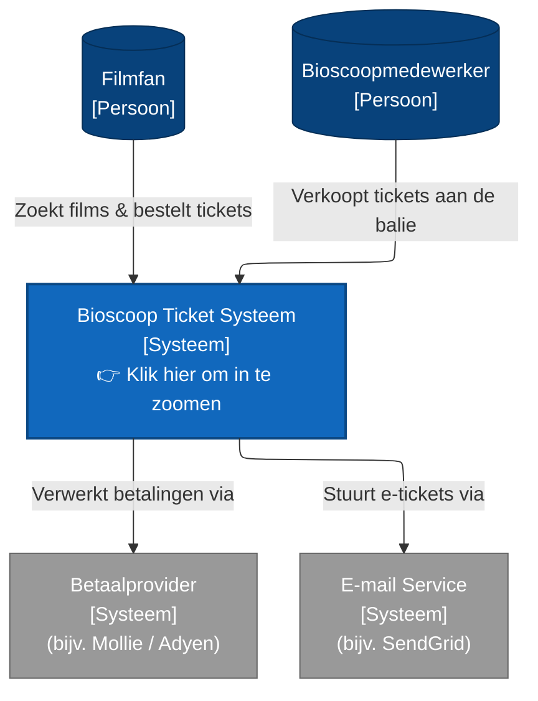

```mermaid
---
config:
  flowchart:
    defaultRenderer: "elk"
---
flowchart TB
    %% Styling
    classDef person fill:#08427b,stroke:#052e56,color:#fff
    classDef system fill:#1168bd,stroke:#0b4884,color:#fff,cursor:pointer,stroke-width:2px
    classDef external fill:#999999,stroke:#666666,color:#fff

    %% Actoren
    Klant[("Filmfan\n[Persoon]")]:::person
    Kassa[("Bioscoopmedewerker\n[Persoon]")]:::person

    %% Het Hoofdsysteem (Klikbaar)
    TicketSysteem["Bioscoop Ticket Systeem\n[Systeem]\n👉 Klik hier om in te zoomen"]:::system

    %% Externe Systemen
    Betaal["Betaalprovider\n[Systeem]\n(bijv. Mollie / Adyen)"]:::external
    Mail["E-mail Service\n[Systeem]\n(bijv. SendGrid)"]:::external

    %% Relaties
    Klant -->|"Zoekt films & bestelt tickets"| TicketSysteem
    Kassa -->|"Verkoopt tickets aan de balie"| TicketSysteem
    
    TicketSysteem -->|"Verwerkt betalingen via"| Betaal
    TicketSysteem -->|"Stuurt e-tickets via"| Mail

    %% De doorklik-link
    click TicketSysteem "./02-containers.md" "Open de Containers"
```