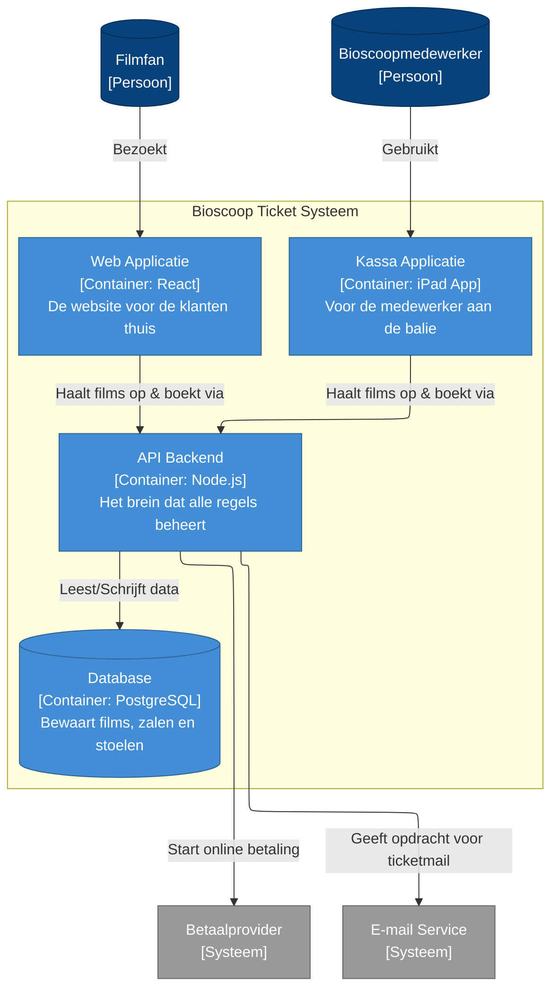

```mermaid
---
config:
  flowchart:
    defaultRenderer: "elk"
---
flowchart TB
    %% Styling
    classDef person fill:#08427b,stroke:#052e56,color:#fff
    classDef container fill:#438dd5,stroke:#2e6295,color:#fff
    classDef external fill:#999999,stroke:#666666,color:#fff
    classDef database fill:#438dd5,stroke:#2e6295,color:#fff,shape:cylinder

    %% Actoren & Externe systemen van Niveau 1 (als context)
    Klant[("Filmfan\n[Persoon]")]:::person
    Kassa[("Bioscoopmedewerker\n[Persoon]")]:::person
    Betaal["Betaalprovider\n[Systeem]"]:::external
    Mail["E-mail Service\n[Systeem]"]:::external

    %% De binnenkant van ons systeem
    subgraph TICKETS ["Bioscoop Ticket Systeem"]
        direction TB
        
        WebApp["Web Applicatie\n[Container: React]\nDe website voor de klanten thuis"]:::container
        POS["Kassa Applicatie\n[Container: iPad App]\nVoor de medewerker aan de balie"]:::container
        
        API["API Backend\n[Container: Node.js]\nHet brein dat alle regels beheert"]:::container
        
        DB[("Database\n[Container: PostgreSQL]\nBewaart films, zalen en stoelen")]:::database
    end

    %% Relaties
    Klant -->|"Bezoekt"| WebApp
    Kassa -->|"Gebruikt"| POS

    WebApp -->|"Haalt films op & boekt via"| API
    POS -->|"Haalt films op & boekt via"| API

    API -->|"Leest/Schrijft data"| DB
    API -->|"Start online betaling"| Betaal
    API -->|"Geeft opdracht voor ticketmail"| Mail
```