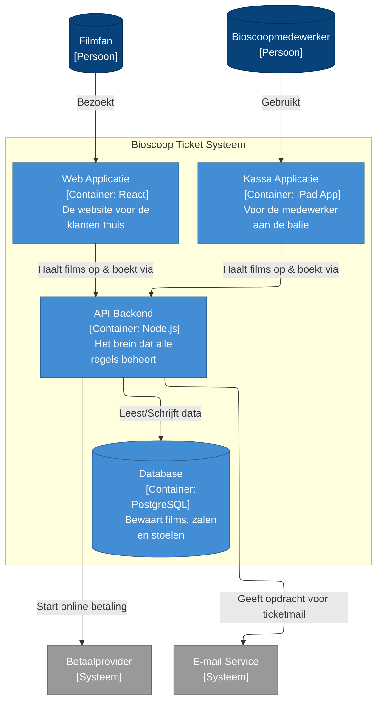

# 📦 Niveau 2: Containers (Bioscoop Ticket Systeem)

Hier zoomen we één stap dieper in en openen we de "zwarte doos" van ons hoofdsysteem. Dit overzicht is vooral waardevol voor software architecten, systeembeheerders en ontwikkelaars.

In dit diagram zie je de zogenaamde *deployable units*: de grote, onafhankelijk draaiende onderdelen (containers) waaruit ons systeem bestaat. Het toont de interactie tussen onze frontends, backend API's en databases, en geeft de belangrijkste technologische keuzes (zoals React en Node.js) weer.

