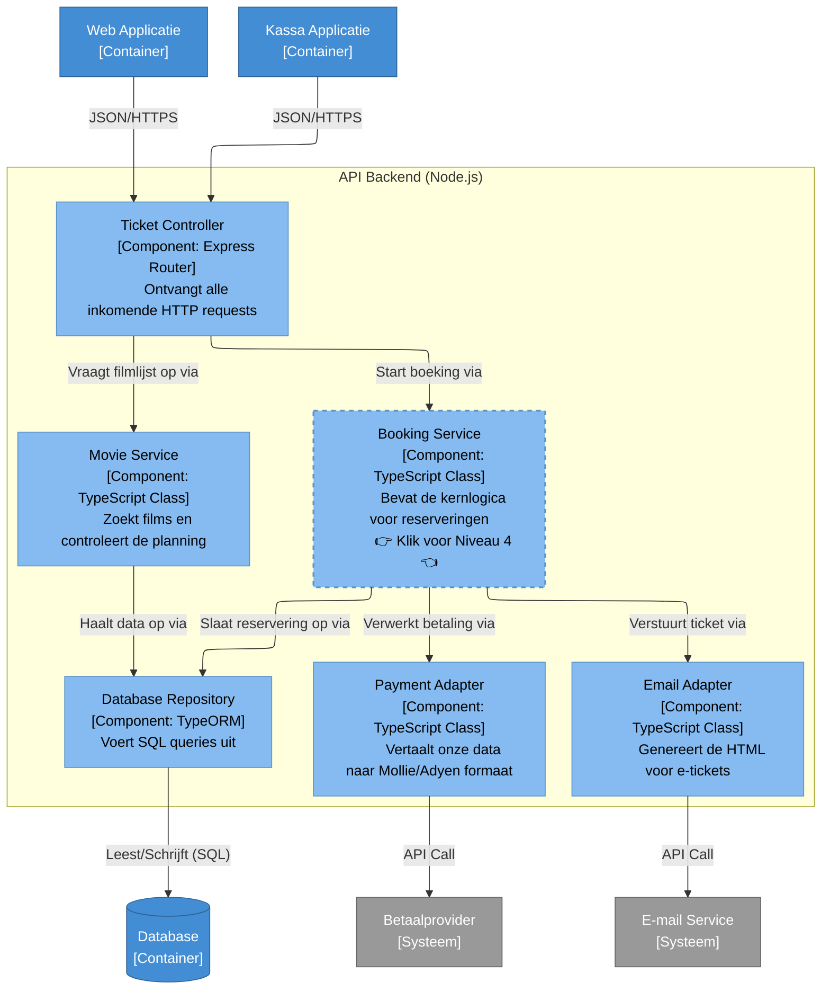

# 🧩 Niveau 3: Componenten (API Backend)

Hier zijn we ingezoomd op de **API Backend (Node.js)**. Dit diagram is specifiek bedoeld voor het backend-team. 

We zien hier hoe de inkomende netwerkverzoeken worden opgevangen door de controllers, hoe de businesslogica is opgesplitst in specifieke services, en hoe de adapters praten met de buitenwereld.

*(👉 **Tip:** Klik op de Booking Service om door te zoomen naar de broncode in Niveau 4.)*

🔙 **[Klik hier om terug te gaan naar Niveau 2: Containers](./02-containers.md)**