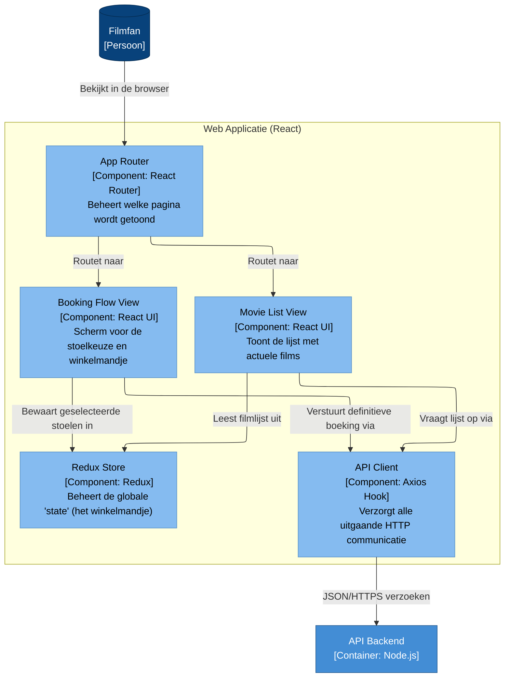

# 🧩 Niveau 3: Componenten (Web Applicatie)

Hier zijn we ingezoomd op de **Web Applicatie (React)**. Dit diagram is bedoeld voor de frontend developers.

We zien hier hoe de Single Page Application (SPA) in de browser van de klant is opgebouwd. Het toont de routing, de belangrijkste weergave-componenten, hoe de data lokaal wordt vastgehouden (Redux), en hoe de applicatie praat met onze API.

🔙 **[Klik hier om terug te gaan naar Niveau 2: Containers](./02-containers.md)**