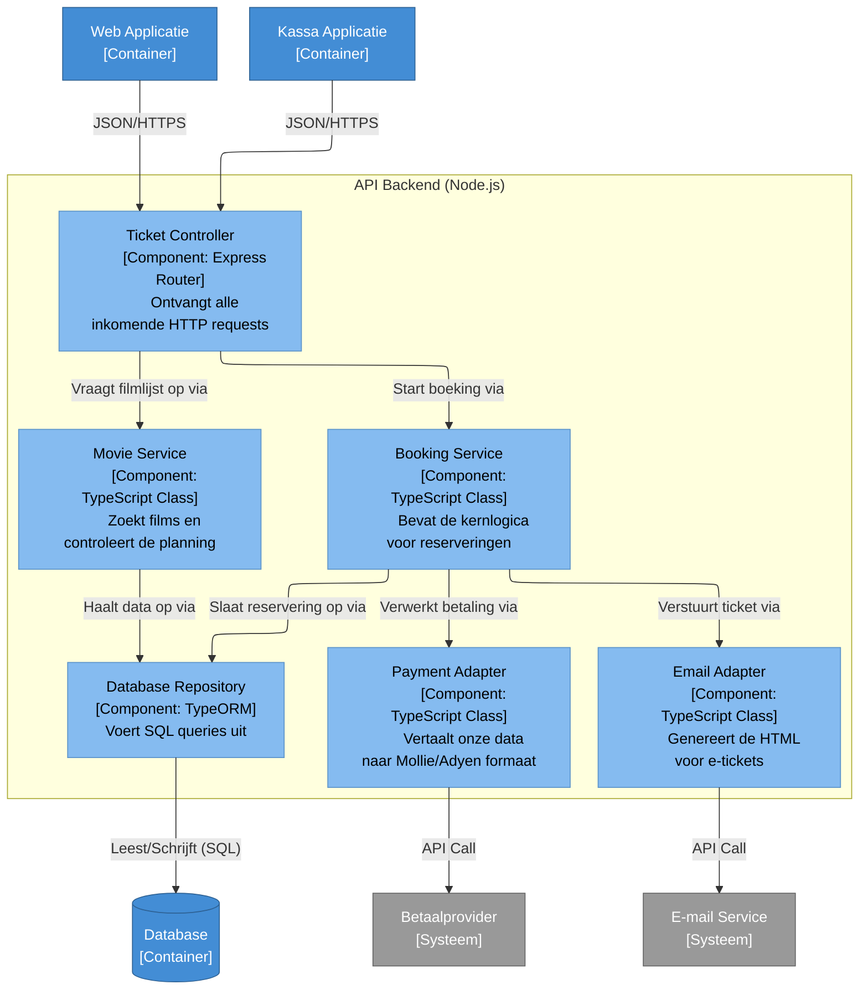

# 🧩 Niveau 3: Componenten (API Backend)

Hier zoomen we in op één specifieke container uit het vorige niveau: de **API Backend**. 

Dit diagram toont de interne structuur van de Node.js applicatie. Ontwikkelaars kunnen hier zien hoe de code logisch is opgedeeld in controllers, services en repositories, en hoe deze onderdelen samenwerken om een ticket te boeken.

