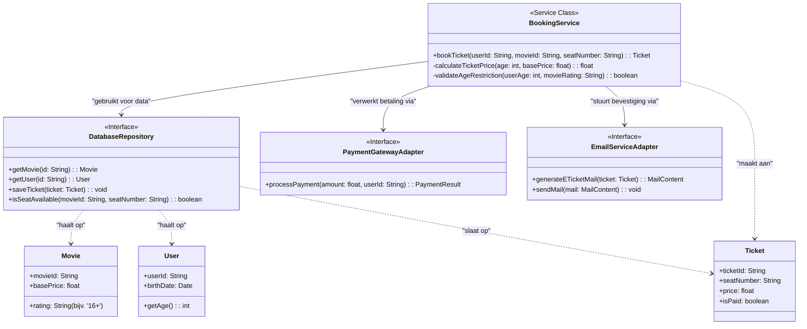

# 💻 Niveau 4: Code (Booking Service)

We zijn nu aangekomen op het diepste niveau van ons bioscoop-voorbeeld. Dit diagram is puur bedoeld voor de ontwikkelaar die verantwoordelijk is voor de implementatie van de kern-boekingslogica.

We zoomen hier in op de interne structuur van het **Booking Service** component dat we zagen in het vorige diagram. We behandelen hier niet de gehele code, maar uitsluitend het cruciale traject om een ticket te boeken. 

Dit diagram toont de daadwerkelijke klassen (interfaces) en hun belangrijkste methodes. 

*(👉 **Tip:** Klik op de knop onderaan om terug te gaan naar het Componenten-diagram.)*

*(Kijk in het diagram hierboven voor de specifieke code-implementatie)*

🔙 **[Klik hier om terug te gaan naar Niveau 3: Componenten](https://github.com/jensdev/architecture-as-code/blob/main/03-components-api.md)**